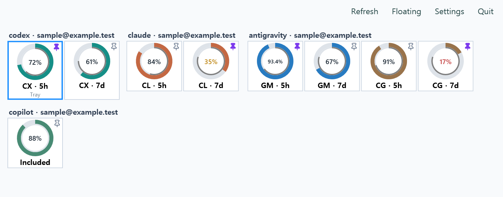
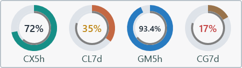

# Agent Quota Monitor for Windows

Keep an eye on your AI coding quotas, reset times, and how fast you are spending them, straight from the Windows tray.

**[Download Windows installer](https://github.com/mahlernim/agent-quota-monitor-windows/releases/download/v0.2.1/agent-quota-monitor-windows-0.2.1-setup-win-x64.exe)** · [Portable ZIP](https://github.com/mahlernim/agent-quota-monitor-windows/releases/download/v0.2.1/agent-quota-monitor-windows-0.2.1-win-x64.zip) · [Release notes](https://github.com/mahlernim/agent-quota-monitor-windows/releases/tag/v0.2.1)

*Main window. Accounts and quota values shown are sample data.*

*Floating monitor. Accounts and quota values shown are sample data.*

## Quick start

1. Download and run the Windows x64 installer above.
2. Follow the setup wizard. No administrator rights are needed.
3. Open **Agent Quota Monitor** from the Start menu.
4. Open **Settings**, choose the providers you want, and click **Save monitored providers**. Connect any that are not detected yet.

The installer creates a Start menu shortcut and optionally a desktop shortcut. Python and .NET runtimes are bundled. You still need the official coding clients for the providers you use.

Prefer a portable app? Download the ZIP, extract **all** files into a permanent folder, and run `agent-quota-monitor-windows.exe`. Do not run it from inside the ZIP.

The installer and application are unsigned. Windows may display an unknown-publisher warning.

## Providers

Any combination works, and one provider is enough. The monitor reads quotas through the sessions your official clients already created, so a browser login by itself may not be recognized.

| Provider | How to connect | Notes |
| --- | --- | --- |
| OpenAI Codex | Settings, then **Sign in** | Launches the official Codex client sign-in |
| Anthropic Claude (direct) | Settings, then **Sign in** | Launches the official Claude Code subscription sign-in |
| Google Antigravity | Sign in to the official `agy` CLI, or **Open official client** in Settings | The CLI account keeps refreshing with the desktop app closed |
| GitHub Copilot (optional) | Settings, then **Sign in** | Opens `gh auth login` in a console and your browser |

If an existing session is already recognized, you do not need to sign in again.

For Antigravity background monitoring, install and sign in to the [official CLI](https://antigravity.google/docs/cli/install), run `agy -p /usage` once, then press **Refresh** in the monitor. Pin quotas on the account marked **CLI** to monitor them while the desktop app is closed. After a successful CLI reading, the monitor uses that account instead of desktop-source cards. If no CLI connection has been established, the running desktop app can supply readings. Failed reads preserve the last value as stale. API-key mode is not supported for subscription monitoring.

Copilot needs a one-time optional setup with PowerShell 7, Node and npm, Python, and the GitHub CLI, using `Setup-Copilot.ps1` from the source repository. See [Copilot setup](docs/copilot-setup.md).

Accounts stay separate, even when their email labels match. Direct Claude subscriptions are separate from Claude or GPT allowance supplied by Antigravity. To change accounts, use the provider's own client. The monitor follows the verified client identity and never switches accounts automatically.

**Remove** hides an account and stops monitoring it. It does not log you out of the provider or touch your credentials. **Restore hidden accounts** brings it back.

## Everyday controls

- **Click a ring** in the main window to pick the quota shown in the system tray. The chosen one is labelled **Tray**.
- **Click the pin at the top-right corner of a ring** to pin or unpin that quota on the floating monitor. Filled violet means pinned. A hollow slate pin means unpinned.
- **Toolbar**, at the top right, has Refresh, Floating, Settings, and Quit.
- **Hover a ring** for exact percentages, reset times, and pace details.
- **Close** hides the main window to the tray. **Quit** exits, and stops the quota reader if this app started it.
- **Reorder accounts** in Settings. Choose **Edit order**, use **Move up** and **Move down**, then click **Save order**. **Cancel** discards the unsaved order.

Settings also shows each account's identity, reading source, and retry status. Account controls and quota details are available in the Windows app.

Right-click the floating monitor for **Size** (75, 100, 125, 150, 200%) and **Opacity** (35, 50, 70, 85, 100%). Drag it to move it, and double-click it to bring back the main window. Its size, opacity, and position are remembered.

## Reading a quota ring

The thick outer ring is quota remaining, in a color that identifies the provider. The thin gray ring just inside it is time remaining in the current window, and it appears only when the reset timing is known. Percentages show at most one decimal.

The number turns **amber** when quota remaining falls below half of time remaining, and **red** below one quarter. For example, with 80% of the window left, amber starts under 40% quota and red under 20%. Without timing data there is no pace warning at all.

A gray, stale reading is the last available value and could not be refreshed. It does not mean zero, and a missing window never means unlimited. Reaching the displayed reset time does not confirm replenishment until the provider returns a new reading.

## Start with Windows

Settings has an optional **Start with Windows (in the tray)** switch. It is off by default and needs no administrator rights. If you use the portable ZIP, keep its folder in a permanent place. Turn the switch off before moving the folder, then turn it on again from the new location.

## Updates

Automatic update checks contact GitHub shortly after startup, with at most one attempt every 24 hours, including failed attempts. A banner offers **Download update**, **Later**, **Skip this version**, and **Release notes**. Nothing is installed automatically.

**Later** postpones reminders for a day. **Skip this version** hides that release across restarts. **Check for updates** in Settings checks immediately and reconsiders skipped releases. Settings also lets you disable automatic checks. This stable release offers stable updates only.

Download update opens the official release page. Quit the monitor, run the new installer, and keep the same installation folder. Settings and account bindings are preserved. Portable users should quit before replacing their extracted files.

Uninstall through Windows Installed apps. App files, shortcuts, and this installation's startup entry are removed. Monitor settings and vendor accounts are preserved.

## Troubleshooting

- **An account is missing.** Sign in through the provider's own client, then press Refresh. A browser-only login may not create the session the monitor reads.
- **A reading is stale.** Press Refresh and confirm the provider's client still has a valid session. Refresh respects provider cooldowns. Settings shows when an account can be retried.
- **Copilot shows nothing.** Complete the one-time setup in [Copilot setup](docs/copilot-setup.md), then use Copilot **Sign in** and finish the prompts in the console window that opens.
- **Nothing happens when launching.** Confirm you extracted the whole ZIP, including the `backend` folder, next to the executable.
- **An update check failed.** Use **Check for updates** in Settings to retry immediately. Automatic checks wait until the next daily attempt.

## Privacy

- Credentials stay with the official clients. The monitor reads local sessions and never logs you out, switches accounts, or routes traffic through a proxy.
- Quota settings and cached snapshots are encrypted for your Windows user account. Non-secret update preferences are stored in your user registry.
- The quota reader communicates with the Windows app over loopback only. It is intended for a trusted personal computer and does not isolate access from other local processes.
- No telemetry, automatic public uploads, or prompts sent to a model to estimate quotas.

Provider interfaces are internal to those products and can change without notice, which may interrupt readings.

## More

- [Windows details](docs/windows.md)
- [Building and contributing](docs/development.md)
- [Third-party notices](THIRD-PARTY-NOTICES.md)

MIT licensed. Independent project, not affiliated with or endorsed by any of the supported providers.
