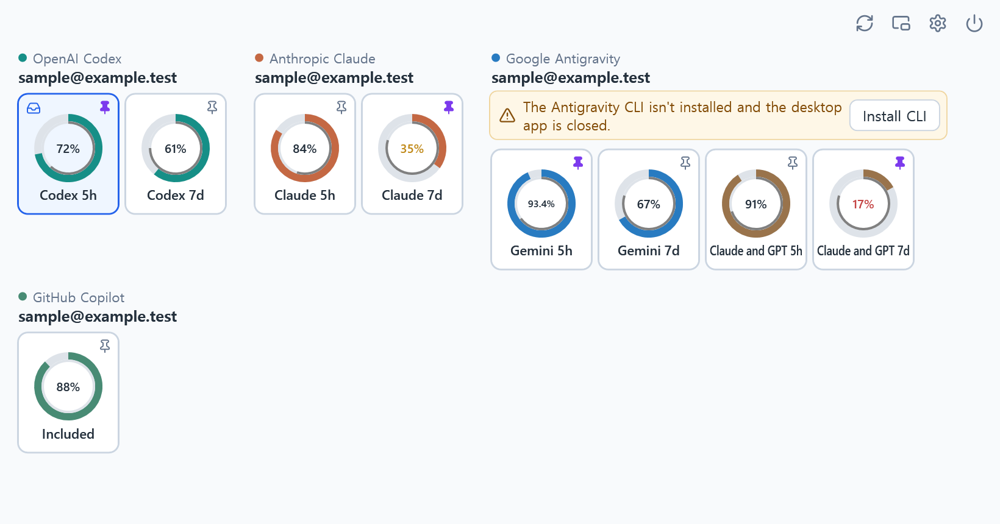
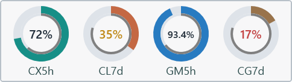

# Agent Quota Monitor for Windows

Keep your AI coding quotas in view without opening each provider. Agent Quota Monitor brings OpenAI Codex, Anthropic Claude, Google Antigravity, and GitHub Copilot into one Windows tray app. See what remains, when it resets, and whether your usage is ahead of pace. Pin the quotas you care about to a compact floating monitor.

It uses your official clients' existing sign-ins and sends no model prompts to check quota.

[Visit the website](https://ahn-lab.org/agent-quota-monitor-windows/) for a quick tour and a visual guide to reading quota rings.

**[Download the Windows installer](https://github.com/mahlernim/agent-quota-monitor-windows/releases/download/v0.4.2/agent-quota-monitor-windows-0.4.2-setup-win-x64.exe)** · [Portable ZIP](https://github.com/mahlernim/agent-quota-monitor-windows/releases/download/v0.4.2/agent-quota-monitor-windows-0.4.2-win-x64.zip) · [Release notes](https://github.com/mahlernim/agent-quota-monitor-windows/releases/tag/v0.4.2)

*Main window. Accounts and quota values shown are sample data.*

*Floating monitor. Accounts and quota values shown are sample data.*

## Why use it

- **One place for your coding quotas.** Use any combination of the four supported providers. One provider is enough.
- **Pace, not just percentages.** Each ring compares quota left with time left in its window and warns you in amber or red when you are ahead of pace.
- **Uses your existing sign-ins.** Connect through each provider's official client. Authentication and session renewal stay with that client.
- **Honest when data is old.** Values that could not be refreshed stay visible in gray with the reason, and values from before a reset are shown as unknown.
- **Fixes where you look.** When an account has a problem, a short banner under it explains why and offers the one action that helps.
- **Local and private.** No telemetry or prompts for quota checks. Monitor settings and cached quota are encrypted for your Windows account.
- **Optional idle-window activation.** Start an idle subscription countdown with one short subscription prompt after an observed idle period. Off until you enable it.

## Contents

- [Install](#install)
- [Connect your providers](#connect-your-providers)
- [Read a quota ring](#read-a-quota-ring)
- [Everyday use](#everyday-use)
- [Optional quota window activation](#optional-quota-window-activation)
- [Stale readings and what they mean](#stale-readings-and-what-they-mean)
- [Start with Windows](#start-with-windows)
- [Updates](#updates)
- [Troubleshooting](#troubleshooting)
- [Privacy](#privacy)

## Install

For Windows 10 or 11 on x64. Python and .NET runtimes are bundled. You need an eligible account and the official coding client for each provider you enable.

1. Download and run the [Windows x64 installer](https://github.com/mahlernim/agent-quota-monitor-windows/releases/download/v0.4.2/agent-quota-monitor-windows-0.4.2-setup-win-x64.exe). No administrator rights are needed.
2. Open **Agent Quota Monitor** from the Start menu.
3. Open **Settings** (the gear icon) and tick the providers you use. Changes save right away.
4. Follow the account's setup or sign-in button if needed. Once a reading appears, click a ring to put it in the tray and click its pin to add it to the floating monitor.

**Portable copy.** Download the ZIP, extract **all** files into a permanent folder, and run `agent-quota-monitor-windows.exe`. Do not run it from inside the ZIP. Keep the `backend` folder beside the executable.

The installer and application are unsigned, so Windows may show an unknown-publisher warning.

## Connect your providers

Enable only the providers you use. Existing official sessions are normally discovered within a minute. The first reading may take longer if the provider is unavailable or a cooldown is active.

| Provider | Official source the monitor reads | How to connect |
| --- | --- | --- |
| OpenAI Codex | Codex app or CLI session | Settings, then **Sign in**, or **Install Codex** if it's missing |
| Anthropic Claude (direct subscription) | Claude Code session | Settings, then **Sign in**, or **Install Claude Code** if it's missing |
| Google Antigravity | Antigravity CLI (`agy`), or the running desktop app | Settings, then **Install CLI** or **Open desktop app** |
| GitHub Copilot (optional) | GitHub CLI and Copilot SDK | Settings, then **Set up Copilot** and **Connect**. See [Copilot setup](docs/copilot-setup.md) |

A browser-only login may not create the session the monitor reads. Sign in through the official client instead.

If Codex or Claude Code isn't installed, Settings and the main window offer its official installer in place of **Sign in**. The confirmation shows the exact command, and it runs in a visible PowerShell window only after you choose OK. Clients installed while the monitor runs are found within a minute.

The official clients manage their own sessions. If a login needs attention, follow its account banner. Temporary read failures retry automatically and keep the previous reading marked stale.

### Anthropic Claude

The monitor reads the sign-in saved by **Claude Code**, Anthropic's command-line tool. Signing in to the Claude desktop app or claude.ai alone isn't enough, because neither saves a session the monitor can read. Claude Code needs a Claude Pro, Max, Team, or Enterprise plan.

1. In Settings, tick **Anthropic Claude**. If Claude Code is missing, choose **Install Claude Code** and confirm. The official installer runs in a PowerShell window.
2. When it finishes, choose **Sign in**. It can take up to a minute to replace the install button.
3. A Claude Code window and your browser open. Sign in in the browser. If the browser shows a code instead of returning, paste it into the Claude Code window.

The account appears once its quota has been read.

Use Claude Code 2.1.281 or a newer 2.x version for quota reads through its built-in `/usage` command. Claude Code handles authentication and renewal during that read. No message or available model quota is needed. Settings shows **Claude Code CLI (session managed by CLI)**. This source reports the session and all-model weekly windows. Model-specific windows are not currently available through it.

The monitor uses the default Claude Code subscription login. API keys, alternate endpoints, and custom configuration directories set in environment variables do not redirect its reads. Your environment and client settings stay unchanged.

Older clients, or clients whose version cannot be checked, use the saved-session reader. Settings shows that session's expiry. If it expires, choose **Sign in**. Signing in does not reset quota. A failed version check is retried after five minutes.

### Google Antigravity

The official Antigravity CLI (`agy`) is the recommended source. It lets the monitor read quota even while the Antigravity desktop app is closed. Without it, Antigravity readings stop whenever the desktop app closes.

- **Install CLI** appears in Settings when `agy` is missing. It first shows Google's exact install command, `irm https://antigravity.google/cli/install.ps1 | iex`, and runs nothing unless you confirm.
- After you confirm, a visible PowerShell window runs that official installer, then `agy -p /usage`. Sign in through your browser if it opens. The monitor picks up the CLI within a minute.
- You can also install it yourself from the [official instructions](https://antigravity.google/docs/cli/install), run `agy -p /usage` once, and press **Refresh**.
- Gemini CLI is a different product and does not report Antigravity subscription quota.
- API-key and custom-provider modes are not supported for subscription monitoring.

The monitor displays one Antigravity source at a time. It prefers **CLI**, which works with the desktop app closed. If the CLI fails and the running desktop app supplies a fresh reading, only the desktop account is shown until the CLI recovers. If neither source can refresh, the CLI card keeps its last reading and error without adding an old desktop card. Each source retains its own account identity and saved pins. Provider cooldowns and hidden-account choices are respected.

### Accounts stay separate

Accounts are matched by stable provider identity, never by email label, so two accounts with the same address stay separate. Direct Claude subscriptions are kept apart from the Claude and GPT allowance supplied by Antigravity. To change accounts, use the provider's own client.

**Hide** (the crossed-out eye in Settings) stops monitoring an account. It does not sign you out or touch credentials. **Restore hidden accounts** brings it back.

## Read a quota ring

The thick outer ring is quota remaining, drawn in the provider's color. The thin gray ring inside it is time remaining in the current window. It appears only when the reset time is known.

The percentage turns **amber** when quota remaining falls below half of time remaining, and **red** below one quarter. For example, with 80% of the window left, amber starts under 40% quota and red under 20%. Without timing data there is no pace warning.

Hover any ring for exact values, the reset time, pace, and, when something is wrong, what to do about it.

An Antigravity window explicitly reported as **Disabled** keeps its ring and saved pin. If a fresh weekly reading in the same account and model group confirms 0% remaining, its disabled five-hour ring shows **0%** and its tooltip explains **0% available · Weekly limit reached**. Any countdown is labeled **Weekly reset**, with no five-hour pace ring. This describes baseline quota only. AI Credit overages may still allow use. Otherwise, Disabled shows no percentage or countdown. It returns to its normal display when the provider reports an active window.

## Everyday use

- **Click a ring** to show that quota in the system tray. The chosen ring gets a blue outline and a small tray icon.
- **Click the pin** at a ring's top-right corner to pin or unpin it on the floating monitor. Filled violet means pinned.
- **Right-click a ring** to show it in the tray, pin it, move it, move its account, or copy its details.
- **Drag a ring** to reorder it within its account, or **drag an account name** to reorder accounts. With the keyboard, press Alt with the arrow keys on a focused ring. Pins and the tray choice follow their rings.
- **Toolbar icons.** Refresh, floating monitor, Settings, and Quit. Hover an icon to see what it does.
- **Refresh feedback.** The refresh icon spins with a “Refreshing…” label while the reader works. A brief message reports updated accounts, no new readings, or a failure. Provider cooldowns still apply, and repeated clicks are disabled until the refresh finishes.
- **Floating monitor.** Drag to move it, double-click to open the main window, and right-click for **Size** (75 to 200%) and **Opacity** (35 to 100%). Its size, opacity, and position are remembered.
- **Close** or **Esc** hides the main window to the tray. **Quit** exits and stops the quota reader it started.

### Names on rings

Rings show short names such as **Codex 5h** or **Gemini 7d**. The default tray initials are CX for Codex, CL for Claude, AG for Antigravity Gemini, AC for Antigravity Claude and GPT, and CP for Copilot. Change both under **Quota names** in Settings. Long names are narrowed to fit, and the floating monitor falls back to initials when a name doesn't fit. Names never change colors or which account a ring belongs to.

### Settings

Each account takes one row with its status. **Details** shows the last and next read, session times, and the reading source. The copy icon copies support details without credentials or your account label. To reorder accounts there, choose **Edit order**, drag rows or press Alt with Up and Down, then **Save order**. **Esc** closes Settings, or discards an unsaved order first.

## Stale readings and what they mean

A gray ring with a **stale** badge shows the last value the monitor could read. It never means zero, and a missing window never means unlimited. A banner under the account explains the cause and offers the fix.

| Banner | What it means | Action |
| --- | --- | --- |
| The Antigravity CLI isn't installed and the desktop app is closed | No Antigravity source is running | **Install CLI**, or open the desktop app |
| The Antigravity CLI needs sign-in | The CLI session lapsed | **Copy command**, then run `agy -p /usage` in a terminal |
| Codex didn't accept the saved session | The Codex session lapsed | Open Codex, or **Sign in** |
| Your Claude Code session expired | The saved Claude Code session needs renewal | Choose **Sign in**. No message or available quota is needed |
| Codex or Claude Code isn't installed | No official client was found | **Install Codex** or **Install Claude Code** |
| GitHub Copilot isn't set up yet, or Copilot is set up | Setup is incomplete, or no GitHub account is linked | **Set up Copilot**, then **Connect** |
| No network connection | Requests couldn't reach the provider | **Retry**, or wait. The monitor also retries when Windows reconnects or wakes |
| The monitor could not interpret the provider response | The response contains data the monitor does not recognize | **Check for updates** |
| Reading again after the monitor restarted | An unreadable response saved before a restart or update is being read again | Wait. The next reading replaces it |
| Reset since the last read (ring tooltip) | The window reset after the value was read | Wait for the next reading. The old value is hidden |

If a source becomes unavailable, its cached reading becomes stale. When discovery no longer finds an account, a recent reading can remain live for up to ten minutes. Closing a desktop app does not stop monitoring when its CLI or saved session can still supply quota.

**Refresh** reads eligible accounts without bypassing provider cooldowns. An unchanged percentage can still be a successful refresh. If it reports no new readings, open **Settings → Details** to see the next eligible read and any error. Retry schedules are kept across restarts and updates. An unreadable-response error is the exception. It is read again as soon as the monitor starts, so an update that fixes it takes effect right away.

## Start with Windows

Settings has an optional **Start with Windows (in the tray)** switch. It is off by default and needs no administrator rights. For a portable copy, turn it off before moving the folder, then turn it on again from the new location.

## Updates

The monitor checks GitHub for a new release shortly after startup and then at most every 3 hours. When a release is available, a banner appears in the main window.

- **Install update** (installed copies only) downloads the installer from the official Agent Quota Monitor release on GitHub, verifies it against the published SHA-256 checksum, closes the monitor, and opens the installer. Nothing is installed without your confirmation, and nothing runs if verification fails.
- **Download update** opens the release page instead. Portable copies always use this. Quit the monitor before replacing the extracted files.
- **Later** postpones the reminder for a day. **Skip this version** hides that release.

**Check now** in Settings checks immediately. You can turn off automatic checks there. Settings, cached quota, and account bindings are kept across updates.

To uninstall, use Windows **Installed apps**. App files, shortcuts, and the startup entry are removed. Monitor settings and provider accounts are kept.

## Troubleshooting

- **An account is missing.** Sign in through the provider's official client, wait a minute, then press **Refresh**.
- **Antigravity goes stale when the desktop app closes.** Install the Antigravity CLI from Settings. See [Google Antigravity](#google-antigravity).
- **An Antigravity CLI account is stale.** Wait for the next eligible read shown in Settings, then press **Refresh**. If the CLI needs sign-in, run `agy` in a terminal, sign in, run `agy -p /usage`, and refresh again.
- **Claude says the session expired, but Claude Code is open.** Older clients use the saved-token reader. Update Claude Code to use CLI-managed reads. If the official client still requires a new login, choose **Sign in** and complete the browser login. No message is needed, even when your five-hour quota is exhausted. Signing in does not reset your quota.
- **Claude Code could not read quota.** Open Claude Code and run `/usage` to check its connection. The monitor keeps the last reading marked stale and retries automatically. A failed quota read alone does not mean you need to sign in again.
- **Codex says the session wasn't accepted.** Open the Codex app or CLI. If that doesn't help, use **Sign in**.
- **Codex Sign in stops right away.** The Codex client exited before sign-in started. Update it with `npm install -g @openai/codex@latest`, check `~/.codex/config.toml`, or sign in through the Codex app.
- **Claude says the read was rejected.** Check `claude auth status`, open Claude Code to let it renew its session, and press **Refresh**. If it still fails, sign in again through Claude Code.
- **Copilot shows nothing.** Choose **Set up Copilot** in Settings, then **Connect**. See [Copilot setup](docs/copilot-setup.md).
- **The quota reader is unavailable.** Click the refresh icon, which retries the connection. If it stays unavailable, use **Quit** and reopen the monitor. After an upgrade, the monitor replaces a reader left over from the previous version automatically.
- **The portable copy does nothing when launched.** Make sure the whole ZIP was extracted, including the `backend` folder.
- **An update could not be verified.** Nothing was installed. Try again later or use **Download update**.
- **Something else is wrong, or you have an idea.** Choose **Report it on GitHub** in Settings, or open the [issue page](https://github.com/mahlernim/agent-quota-monitor-windows/issues). Include the copied account details rather than screenshots of your quota.

## Optional quota window activation

Some quota countdowns begin only after a model request. In **Settings → Quota window activation**, you can let AQM send a short prompt after a supported window has remained inactive for 30 minutes. Choose each account and window, enable the feature, then select **Save activation settings**. You can instead wait 60 or 120 minutes.

Activation is off on a fresh install and when first introduced by an update. Later updates retain your choice, account selections, dismissals, and attempt records. New accounts and newly supported windows remain unselected. Quota checks stay prompt-free.

Supports **Codex weekly**, **direct Claude five-hour and weekly**, and **Antigravity Gemini and Claude/GPT five-hour and weekly** windows. Antigravity groups have separate controls. One prompt can start both windows in its group, so AQM records both and avoids a second prompt. Codex plans without a five-hour window do not get an invented one.

AQM uses the signed-in official CLI with a fixed economical model. Codex uses GPT-6 Luna with low reasoning, Claude uses Haiku, Antigravity Gemini uses Flash, and Antigravity Claude/GPT uses GPT-OSS. Claude requires a Pro or Max subscription with extra usage off. Codex requires a recent client with isolated ephemeral execution. Antigravity uses plan mode and requires a CLI without configured plugins or MCP servers. Keep official clients current. Prompts consume subscription allowance, including CLI context that can be much larger than the short reply. There is no paid/API fallback.

AQM requires consecutive fresh successful readings throughout the chosen delay. Full quota with a fixed running countdown, stale readings, unknown reset information, and exhausted weekly quota never trigger activation. After a prompt, two fresh countdown readings must confirm the change. An uncertain delivery is not automatically retried. If a prompt is never confirmed before its window would have ended, for example because the PC slept, AQM records it as expired and waits for a new inactivity period. Settings shows the current activation status. At most five prompts can be sent per account and quota group in 24 hours. For Codex and Antigravity, consecutive full-quota readings must show a deadline moving with time before AQM treats a window as idle.

With activation off, a quiet suggestion can appear in the main window after three hours of confirmed inactivity for a supported account. **Configure activation** opens Settings, **Later** snoozes for a week, and **Don't show again** persists across restarts and updates. Suggestions never send a prompt or enable the feature. You can turn suggestions off in Settings. The app must be running to observe inactivity and act. Sleep or gaps in fresh readings restart the observation period.

## Privacy

- Authentication stays with the official clients. Depending on the source, the monitor invokes a quota-only client command or reads an existing session for a quota request. It does not maintain a separate login, refresh tokens itself, or store raw credentials in its own data.
- Official clients may renew their sessions when invoked. Tokens, cookies, and authorization headers are excluded from monitor logs and copied support details.
- Quota monitoring sends no model prompts. Optional window activation sends one short subscription prompt only for accounts you explicitly select and enable. There is no proxy routing or paid/API fallback.
- Settings and cached quota are encrypted for your Windows account under `%LOCALAPPDATA%\QuotaDashboard`. Non-secret update preferences are stored in your user registry.
- Activation preferences and attempt receipts are encrypted separately in `activation.dpapi` in that same folder. Receipts retain stable account IDs, timestamps, outcomes, and numeric token counts, never prompt responses or credentials.
- The quota reader talks to the app over loopback only. It is meant for a trusted personal computer and does not isolate access from other local programs.
- There is no telemetry. Update checks use GitHub's public releases API without credentials.

Some provider interfaces are internal and can change without notice. The monitor shows only the quota windows a source reports. Missing data is never treated as unlimited.

## More

- [Windows guide](docs/windows.md), included in the portable ZIP
- [Provider interfaces](docs/provider-evidence.md)
- [Building and contributing](docs/development.md)
- [Third-party notices](THIRD-PARTY-NOTICES.md)

MIT licensed. Independent project, not affiliated with or endorsed by any of the supported providers.
